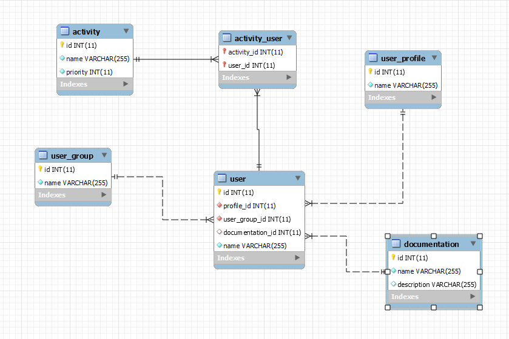
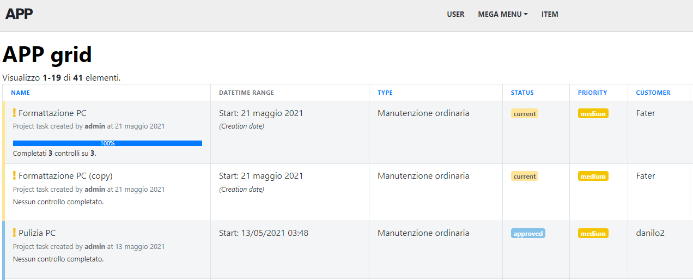
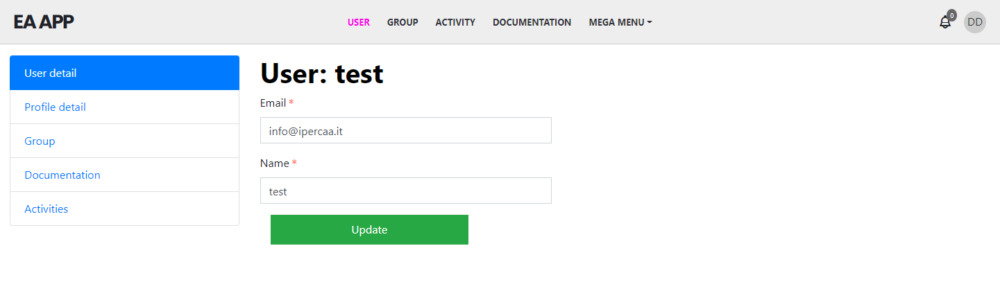

# easyadmin-job
You can clone this repo and use it as boilerplate.

This App has these modules: "User", "Activity", "Group" and "Documentation". 
To get an idea on how those modules are organized here you can see the DB schema:

Each module has to have an item on TOP menu. So TOP menu has these items: "USER", "GROUP", "ACTIVITY" and "DOCUMENTATION".

## The INDEX page
You can get an idea looking at this mockup: 

Click on each item on TOP menu triggers two actions:
* a CSS class "active" (or equivalent) is added on the item. In the above screen, the item is pink colored)
* it goes to the related INDEX page. In this case, it goes to USER INDEX page.

To be clear, I recap the actions with each TOP menu item:
* click on "USER" top menu item: "USER" item gets "active" CSS and destination page is USER::INDEX page. The INDEX page shows all users from User model.
* click on "GROUP" top menu item: "GROUP" item gets "active" CSS and destination page is GROUP::INDEX page. The INDEX page shows all groups from UserGroup model.
* click on "ACTIVITY" top menu item: "ACTIVTY" item gets "active" CSS and destination page is ACTIVITY::INDEX page. The INDEX page shows all activities from Activity model.
* click on "DOCUMENTATION" top menu item: "DOCUMENTATION" item gets "active" CSS and destination page is DOCUMENTATION::INDEX page. The DOCUMENTATION page shows all Document from UserGroup model.
* MEGA MENU has only to show a mega menu on click. To do in next milestone

When click on "update" button on a single record in INDEX page, for example when you click on "update" of "User 1", the APP goes to the DETAIL page.

## The DETAIL page
The desidered layout for DETAIL page is this:

This is an example for DETAIL page of "User" module. You know that we're in "User" module thanks to pink colored "USER" top menu item.
The goal of DETAIL page is to show and modify related values about the current module.
For "User" module, for example, we have this additional infos: 
* **User detail**, the default related info. It show values from User model. By default this item is active, when you arrive from INDEX page
* **Profile detail**, that shows values from UserProfile model where User.id = UserProfile.user_id
* **Group**, that shows values from UserGroup model where User.group_id = UserGroup.id
* **Documentation**, that shows values from Documentation model where User.documentation_id = Documentation.id
* **Activities**, that shows values from Activities model where user_id = activity_id using a joining table due the ManyToMany relation

What happens when you click on each sidebar menu item:
* click on **User detail** shows current User model form. "User detail" item gets "active" CSS class
* click on **Profile detail** shows UserProfile model form related to current User. "Profile detail" item gets "active" CSS class
* click on **Group** shows UserGroup model form related to current User. "Group" item gets "active" CSS class
* click on **Documentation** shows Documentation model form for current User. "Documentation" item gets "active" CSS class
* click on **Activities** shows Activities models forms (be careful, they are many!) for current User. "Activities" item gets "active" CSS class

The sidebar menu, in every module DETAIL page (User, Group, Activity, Documentation) has to be decoupled from top menu and customizable in a easy way. 

The concept of DETAIL page in "User" module, as you can see on the screenshot, is extensible to each other modules. So when you click on "GROUP" on top menu, the item will be "active" and you'll go to GROUP DETAIL page showing a different sidebar menu.
Clicking on "ACTIVITY"? "ACTIVITY" menu item gets "active" CSS class, you go to ACTIVITY DETAIL page and have a different sidebar menu.
Same for "GROUP" and "DOCUMENTATION" top menu items.

So, a top menu item represents a module; click on it it gets you to the module DETAIL page. In that module DETAIL page you have a different sidebar menu depending on module. 

What you see in each module's sidebar in DETAIL page, arriving from related INDEX page:
* in USER module, as we have already seen, we have these items in sidebar menu:
    * User detail (User model)
    * Profile detail (UserProfile model)
    * Group (related UserGroup model)
    * Documentation (related Documentation model)
    * Activity (related Activity models)
* in GROUP module we have these items in sidebar menu:
    * General (current UserGroup model)
    * Users (User models related to current UserGroup)
* in ACTIVITY module we have these items in sidebar menu:
    * General (current Activity model)
    * Users (User models related to current Activity)
* in DOCUMENTATION module we have these items in sidebar menu:
    * General (current Documentation model)
    * Users (User models related to current Documentation)
To prove me sidebar customization you have to display each sidebar menu with a different background color. 

## Mobile view
What I need on top menu when you are in INDEX page: [Look at this video](/public/mobile_user_index_page.mp4)
What I need on top menu when you are in DETAIL page: [Look at this video](/public/mobile_user_detail_page.mp4)

## Requested tasks
I really need is only the DETAIL page
* The main menu has to be on top, rather than on sidebar
* The main menu has to use MenuItem class and other offered EA classes
* The layout has to be responsive 
* The layout has to created using EA templating system, importing EA var
* The left sidebar menu on DETAIL page has to be created using offered EA classes
* The items in the left sidebar menu has to be marked as "active" class when selected using offered EA classes (no IF statements if possibile)
* Each item in the left sidebar has to route to specific Controller: User -> UserController (main page accessible from "User" item in menu on top), Profile -> ProfileController, Documentation -> DocumentationController, Activity -> ActvityController
* When routed, DETAIL User page has to display the related data on the main side, diplaying related form
* Keep in mind that relation between User:UserProfile = 1:1, for the others are 1:M and N:M for User:Activity
* [Optional] The top menu has to have a MEGA Menu (with random items inside) 

As you can see the list is very detailed, but the task is not really complicated. The main focus is the layout with no sidebar for INDEX and a sidebar for DETAIL, with main menu on top. 

Please provider a cost estimation when contact me.