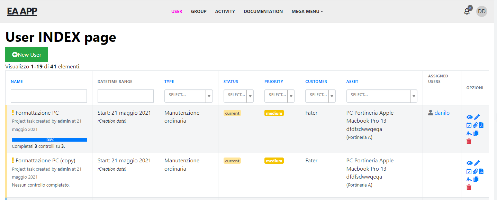

# easyadmin-job
You can clone this repo and use it as boilerplate.

You can see the desidered layout. This is for INDEX page:

And this is for DETAIL page:

As you can see I need a layout with menu on top, rather than on sidebar as displayed in default EA admin.

In the DETAIL page I also need a sidebar menu, where each item/link routes to a custom controller and become active.

In this boilerplate app I've added following entities:
* User
* UserProfile
* Documentation
* Activity

with same fake data in DB.

What I need:
* I've uploaded 2 views (INDEX and DETAIL) just to clarify the layout, but what I really need is only the DETAIL page
* The main menu has to be on top, rather than on sidebar
* The main menu has to use MenuItem class and other offered EA classes
* The layout has to be responsive 
* The layout has to created using EA templating system, importing EA var
* The left sidebar menu on DETAIL page has to be created using offered EA classes
* The items in the left sidebar menu has to be marked as "active" class when selected using offered EA classes (no IF statements if possibile)
* Each item in the left sidebar has to route to specific Controller: User -> UserController (main page accessible from "User" item in menu on top), Profile -> ProfileController, Documentation -> DocumentationController, Activity -> ActvityController
* When routed, DETAIL User page has to display the related data on the main side, diplaying related form
* Keep in mind that relation between User:UserProfile = 1:1, for the others are 1:M and N:M for User:Activity
* [Optional] The top menu has to have a MEGA Menu (with random items inside) 

As you can see the list is very detailed, but the task is not really complicated. The main focus is the layout with no sidebar for INDEX and a sidebar for DETAIL, with main menu on top. 

Please provider a cost estimation when contact me.